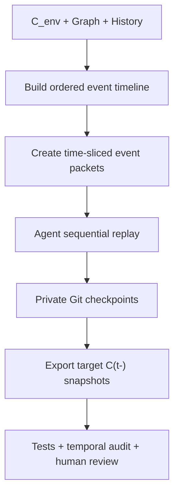

# ReqMemBench 时间点前代码状态还原 Pipeline 设计

## 1. 目标与边界

本阶段的目标是：对于 `gold_states.json` 中每个选中的 target time $t$，构造该任务发生前一刻的可运行代码仓库：

\[
C(t^-) = \operatorname{ReplayCode}\left(C_{\mathrm{env}}, \{\Delta G(m)\mid m<t\}\right)
\]

这里建议使用 $t^-$，而不是字面意义上的 $t-1$。`source_message_id` 并不连续，且同一条消息可能同时改变多个 Requirements。$C(t^-)$ 的准确含义是：

> 已应用所有 `source_message_id < t` 的 Requirement Events，但尚未应用 target message $t$ 中任何变化的代码状态。

最终需要输出 25 个 target 的 pre-task repository。中间所有 Event message 都要按顺序处理并形成内部 checkpoint，但不必全部导出为评测实例。

## 2. 当前数据情况

本项目的 `gold_states.json` 包含：

- 25 个 selected targets，范围为 message 114–785；
- 96 个 target events，其中包括 76 个 `MODIFY`、7 个 `AMBIGUOUS`、6 个 `INTRODUCE`、1 个 `REMOVE`、5 个 `RUNTIME_FAILURE` 和 1 个 `RUNTIME_VERIFICATION`；
- 完整 Requirement State Graph 中共有 343 个 Events，分布在 157 个 Event messages；
- 为得到最后一个 target（message 785）的 $C(t^-)$，需要重放此前 150 个 Event-message groups，共 333 个 Events；
- 第一个 target 是 message 114。在它之前已经存在 12 个 Event-message groups 和 32 个 Events，因此第一个 target 的 pre-state 不是空的 `C_env`。

若将 T001 作为第一个 Benchmark task，则：

\[
C_{\mathrm{start}} = C(114^-)
\]

### 两个必须先解决的问题

1. **现有 `C_env` 只覆盖 Solidity 智能合约子仓库。** 25 个 targets 还涉及 `FRONTEND`、`BACKEND`、`UI_UX`、`AUTH`、`EMAIL`、`STORAGE`、`PAYMENT`、`API` 和 `COMMUNITY_PLATFORM`。如果要保留全部 25 个 targets，必须先构造 project-level composite `C_env`；否则只能筛选智能合约范围内的 targets。
2. **原始聊天中存在 API keys、地址等敏感信息。** 在把历史交给任何 Agent 前，必须先完成 credentials、PII 和真实部署信息清理。Agent 只能看到经过时间截断和脱敏的事件包。

## 3. 总体 Pipeline



核心原则是：**只建立一条顺序演化的代码链，不为每个 target 从 `C_env` 独立生成代码。**

## 4. Pipeline 输入

| 输入 | 作用 |
| --- | --- |
| `C_env` | 无业务 Requirement 的技术环境起点 |
| Stage 1 Annotation | Event type、source message、value/scope updates、ambiguity 和 execution 证据 |
| Requirement State Graph | 根据 `state_id` 取得完整 attributes、scope、lifecycle、ambiguity 和 execution state |
| `gold_states.json` | 指定 25 个 target，并提供 target 的 pre/post project-level state IDs |
| Sanitized conversation history | 为当前 Event 提供必要上下文，但不得包含未来消息 |
| Project context | 技术栈、目录、构建方式和组件关系 |
| Observed/final code | 只能作为非权威实现参考，不得直接作为某个历史时间点的真值 |

`gold_states.json` 本身只有 `requirement_id + state_id`，因此不能单独驱动代码生成。必须使用 Requirement State Graph 将每个 `state_id` 展开为完整 Requirement State。

## 5. Stage 0：组件覆盖与安全预处理

### 5.1 建立 Composite C_env

如果保留全部 25 个 targets，建议把当前智能合约 `C_env` 作为 `contracts/` 子环境，再根据真实技术证据补充中性的项目骨架：

```text
project-cenv/
├── contracts/     # 已完成的 Solidity C_env
├── backend/       # 仅启动、health check、空数据库连接
├── frontend/      # 仅框架入口和空页面
├── shared/        # 通用类型或构建配置，不含业务 schema
├── tests/         # 跨组件 smoke tests
└── cenv_manifest.json
```

不能从 Requirement 名称反向猜测具体框架。React、Next.js、数据库、邮件 SDK 等技术选择必须由代码、部署日志、package files 或可靠聊天证据支持。证据不足的组件要标记为 `simulated`。

`COMMUNITY_PLATFORM` 等外部运营事项不一定产生代码变化，应标记为 `NON_CODE_ACTION`，而不是强行在仓库中生成伪代码。

### 5.2 安全清理

在 Timeline 构建前执行：

- 删除或替换 API keys、private keys、webhook secrets、真实钱包地址和生产 URL；
- 替换客户/开发者身份信息；
- 为每个清理后的 message 保存 source hash 和 redaction log；
- 禁止将未脱敏的完整 `chat_messages.json` 直接交给 Coding Agent。

## 6. Stage 1：构建完整 Event Timeline

从 State Graph 的 edges 中提取所有 Events，并按照以下顺序排序：

1. `source_message_id`；
2. 同一 message 内按照 Stage 1 中的稳定 event order；
3. 同一 message 的多个 Events 组成一个不可拆分的 `EventGroup(m)`。

每个 EventGroup 计算：

- `project_state_before`；
- `project_state_after`；
- `changed_requirements`；
- `preserved_requirements`；
- `state_delta`；
- `affected_components`；
- `code_impact`；
- 是否为 selected target。

不能只重放 `gold_states.json` 中的 25 条 target messages。target 之间未被选择的 Events 仍然会改变后续代码状态，必须进入 Timeline。

## 7. Stage 2：生成时间截断的 Agent Event Packet

每次只给 Agent 一个 EventGroup。推荐生成：

```json
{
  "project_id": "42204309",
  "message_id": 158,
  "sanitized_task_text": "...",
  "event_ids": ["..."],
  "event_types": ["MODIFY", "REMOVE"],
  "pre_requirement_states": [{"requirement_id": "...", "full_state": {}}],
  "post_requirement_states": [{"requirement_id": "...", "full_state": {}}],
  "state_delta": {},
  "preserved_requirement_ids": ["..."],
  "affected_components": ["SMART_CONTRACT", "FRONTEND"],
  "code_action": "MODIFY_AND_REMOVE",
  "known_failures": [],
  "acceptance_criteria": [],
  "forbidden_future_states": []
}
```

Agent 不得获得：

- message $m$ 之后的 conversation；
- 完整未来 State Graph；
- 后续 target 的 gold states；
- 最终代码仓库的无过滤全文；
- 后续 Requirement 的测试、接口名或 TODO。

最终代码如需用作参考，应由检索模块只返回与当前 Requirement 和当前 state 有直接证据关系的片段，并由 temporal leakage checker 再次检查。

## 8. Stage 3：Agent 顺序重放

在私有 construction repository 中初始化 Git：

```text
C_env
  └── EventGroup(m1) → commit m1
        └── EventGroup(m2) → commit m2
              └── ...
```

每个 EventGroup 的处理流程：

1. **Planner Agent**：读取当前 repository 与 Event Packet，输出文件级 change plan、依赖影响和测试计划。
2. **Coding Agent**：只实现当前 delta；不得重写未受影响模块；必须保留 `preserved_requirements` 的行为。
3. **Test Agent**：生成或更新当前时间点可见的 tests，包括新行为、回归行为和删除行为测试。
4. **Reviewer Agent**：独立检查 code–state alignment、future leakage、跨组件一致性和不必要修改。
5. **Repair loop**：未通过时将验证日志返回 Coding Agent，最多重试 3 次；仍失败则进入人工审查，不得自动跳过。
6. 全部门通过后提交 Git commit，并记录 commit hash、Event IDs 和 validation result。

多组件事件建议按照依赖顺序处理：

```text
Smart Contract → Backend/API → Frontend/UI → Email/Storage/Config → Integration Test
```

这样可以避免多个 Agent 同时修改共享 schema 或接口造成不一致。

## 9. 不同 Event/State 的代码处理规则

代码动作不能只根据 `event_type` 判断，应以 replay 后的 `lifecycle + ambiguity + execution` 为最终依据。

| Gold State | Agent 对代码的处理 |
| --- | --- |
| `ACTIVE` 且无 OPEN ambiguity | 实现或更新到当前 attributes/scope |
| `REMOVED` | 删除入口、行为、配置、公开测试和提示性文档；保留必要的数据迁移兼容 |
| `DEFERRED` | 从当前可运行产品中移除；不要保留面向 Agent 的未来 TODO 或占位接口 |
| `CLARIFY` / OPEN ambiguity | 不猜测；已有功能保持最后确认状态，新功能不实现 |
| `RESUME` 后重新 `ACTIVE` | 根据最后确认的完整 state 恢复实现 |
| `IMPLEMENTATION_CLAIM` | 不仅记录声称成功，还要运行可验证测试 |
| `RUNTIME_FAILURE` | 保留或重建可复现的失败，不提前修复；加入 failure reproduction test |
| `RUNTIME_VERIFICATION` | 修复后的回归测试必须通过，并更新 execution status |
| `NON_CODE_ACTION` | repository 不变化，只记录 no-op checkpoint 与原因 |

### Runtime failure 的特殊处理

对于 T008、T010、T020 等包含 `RUNTIME_FAILURE` 的 target，pre-task repository 必须能够复现客户在 target message 中报告的失败，否则 RQ4 的修复任务没有真实代码基础。

构建者可以使用 target message 中的失败描述来验证 $C(t^-)$ 是否具备该 bug，但只能用于恢复失败前提，不能把 target 中提出的新规则或修复提前写入代码。失败状态应记录在：

```json
{
  "known_failures": [
    {
      "requirement_id": "REQ_...",
      "reproduction_test": "...",
      "expected_status": "FAILS_BEFORE_TARGET"
    }
  ]
}
```

因此，某些 $C(t^-)$ 允许存在已知业务失败，但必须满足：项目可安装、可构建、失败可稳定复现、没有提前包含修复。

## 10. Stage 4：在 selected target 前导出 Snapshot

顺序循环建议如下：

```text
for EventGroup(m) in timeline:
    if m is a selected target:
        validate current repo against pre_task_gold_state(m)
        reproduce any failure already observable at m, without applying the fix
        export C(m-)

    apply EventGroup(m)
    validate repo against derived post state
    commit checkpoint
```

同一 target message 中的全部 Events 必须原子化处理：

- 导出的 pre repository 中，一个也不能提前应用；
- post checkpoint 中，全部 Events 都必须处理完成；
- 不能只应用该 message 中较容易实现的某几个 Requirements。

## 11. 验证门

每个导出的 $C(t^-)$ 至少通过以下检查：

### 11.1 正向门

- clean install；
- build / lint / type check；
- 当前已知可工作功能的 tests；
- active requirements 的实现映射完整；
- preserved requirements 的 regression tests；
- 多组件接口和 schema 一致。

### 11.2 状态一致性门

建立 `requirement_code_map.json`：

```json
{
  "requirement_id": "REQ_...",
  "state_id": "REQ_..._S00X",
  "implementation_status": "IMPLEMENTED",
  "files": ["..."],
  "tests": ["..."],
  "confidence": "HIGH"
}
```

允许的状态包括：

- `IMPLEMENTED`
- `NON_CODE`
- `REMOVED`
- `DEFERRED`
- `BLOCKED_BY_AMBIGUITY`
- `KNOWN_FAILED`

### 11.3 时间泄漏门

- target message 的变化尚未出现在 $C(t^-)$；
- 不包含 `source_message_id >= t` 的 Requirement 名称、常量、接口、tests 或 TODO；
- 不包含完整 `gold_states.json`、State Graph 或 construction logs；
- 导出包不包含 `.git`，防止通过 Git objects 读取未来 commits；
- 不包含真实 credentials、生产地址和个人信息。

### 11.4 Target isolation 门

从 `pre_task_gold_state` 和 `post_task_gold_state` 计算 target delta，并生成隐藏检查：

- pre repository 应满足 pre-state tests；
- target 新增/修改行为在 pre repository 中应尚未成立；
- target 删除的行为在 pre repository 中仍应存在；
- target ambiguity 不应被提前猜测；
- target runtime bug 应可以复现。

## 12. 输出目录设计

```text
outputs/code_states/42204309/
├── construction_repo/                 # 私有，包含完整 Git replay history
├── event_packets/                     # 私有，按 message_id 保存
├── checkpoints/                       # 私有，每个 EventGroup 的 commit metadata
├── targets/
│   ├── 42204309_T001/
│   │   ├── pre_repo.zip               # 评测 Agent 输入
│   │   ├── code_state_manifest.json   # 研究者侧
│   │   ├── requirement_code_map.json  # 研究者侧
│   │   └── validation_report.json     # 研究者侧
│   └── ...
└── replay_summary.json
```

`pre_repo.zip` 应通过 `git archive` 或干净目录复制生成，不能直接压缩 construction repository。

推荐的 `code_state_manifest.json` 字段：

```json
{
  "target_id": "42204309_T001",
  "target_message_id": 114,
  "state_boundary": "before_message_114",
  "last_applied_event_message_id": 109,
  "pre_task_state_ids": ["REQ_..._S00X"],
  "unresolved_ambiguities": [],
  "known_failures": [],
  "component_coverage": ["FRONTEND", "BACKEND", "SMART_CONTRACT"],
  "construction_commit": "...",
  "snapshot_sha256": "...",
  "validation": {
    "build": "PASS",
    "state_alignment": "PASS",
    "temporal_leakage": "PASS"
  }
}
```

## 13. 项目 42204309 的推荐执行顺序

### Phase A：先补齐 project-level C_env

1. 保留已经验证的 `contracts/` C_env；
2. 从聊天、部署日志和任何可取得的 package/config 文件提取前端、后端和数据库技术证据；
3. 为有证据的组件构造中性可运行 shell；
4. 对证据不足的组件记录 `simulated` 和 confidence；
5. 完成跨组件 smoke test。

### Phase B：小规模 Pilot

建议先重放 T001–T004 所在的 message 114–159 区间。这一段同时包含：

- frontend/UI 修改；
- 跨 frontend、payment、contract 的多 Requirement task；
- 连续 message 156、158、159；
- `AMBIGUOUS` 处理；
- target 前后状态严格隔离。

Pilot 通过后，再扩展到 T005–T011，最后处理长历史的 T012–T025。

### Phase C：完整重放

- 157 个 Event-message groups 全部建立私有 checkpoint；
- 25 个 selected targets 全部导出 $C(t^-)$；
- 所有 25 个导出 snapshot 进行人工审查；
- `REMOVE`、`AMBIGUOUS`、`RUNTIME_FAILURE`、跨组件和最后一个 target 必须进行重点审查；
- 中间非 target checkpoints 可使用自动验证，并对高风险点人工抽查。

## 14. 最终原则

1. **顺序重放，不独立生成。** 每个状态必须来自前一代码状态加当前 Event delta。
2. **按 message 原子化。** 同一 message 的多个 Requirement Events 一起应用。
3. **Requirement State 是语义真值，代码和测试是其可执行映射。**
4. **实际失败也属于代码状态。** bug target 的 pre repository 不能被提前修好。
5. **没有未来信息。** 构建过程可以使用私有 gold data，但导出的 Agent 输入必须完全时间截断。
6. **当前结果是 canonical reconstructed code timeline。** 在缺少真实 Git 历史时，不应声称这些仓库是真实历史快照。

完成该 Pipeline 后，每个 Benchmark instance 才能形成清晰输入：

\[
H_{<t} + C(t^-) + q_t \longrightarrow \text{Agent Action}
\]

其中 $C(t^-)$ 与 `pre_task_gold_state` 一致，同时既不包含 target 的答案，也不遗漏此前已经发生的代码演化。
