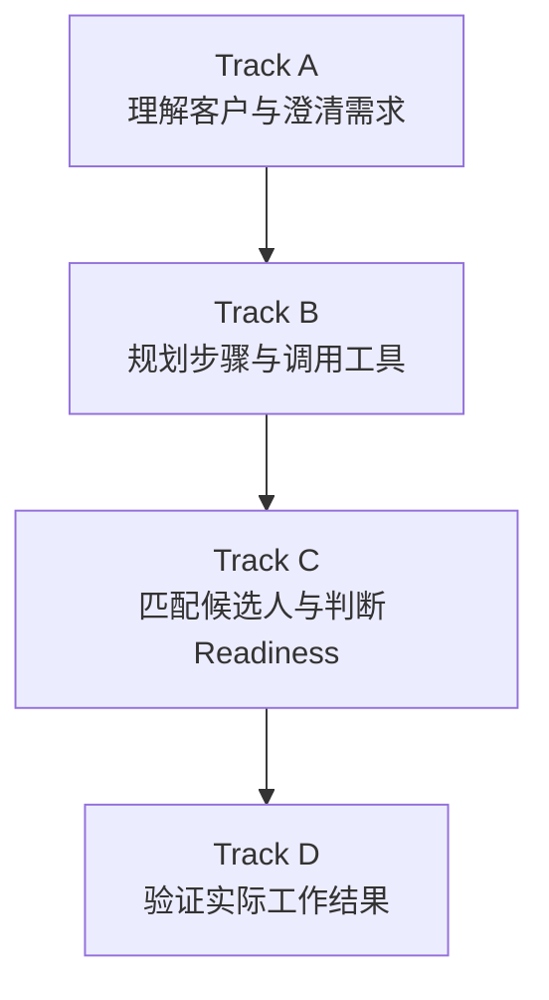
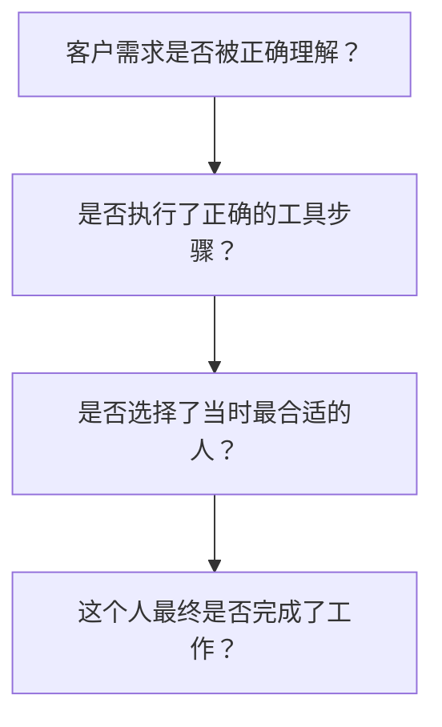

可以。这个 Benchmark 的核心不是把四个 Track 当成四个独立任务，而是把“寻找 Freelancer 的 Agent”完整过程拆成四个可诊断阶段：



这样设计的关键原因是：最终招聘失败，可能不是“推荐算法不好”，而可能是需求理解错了、工具调用错了、候选人当时没有空，或者候选人虽然合适但执行失败。如果只用最终 Pass Rate，就无法定位问题。

下面按照“测什么—怎么构造—如何使用已有数据—如何评估—为什么这样设计”详细说明。

---

# 一、Track A：Intent & Interaction

## 1. Track A要评估什么

Track A评估 Agent 能否把客户自然语言中的模糊需求，逐步转换成一个可执行、可搜索、可验证的任务规格。

例如客户说：

> I need someone to improve my Shopify store. It is too slow.

这句话不足以直接进行招聘。Agent至少需要理解：

* 平台是 Shopify；
* 任务可能是性能优化；
* 当前问题是页面或 checkout 加载慢；
* 需要 Shopify、JavaScript、Web Performance 等技能；
* 预算未知；
* 截止时间未知；
* “多快才算完成”未知；
* 是否可以访问商店后台未知。

因此，Track A实际上包含四种能力：

1. 意图提取；
2. 信息缺口识别；
3. 澄清问题生成；
4. 多轮状态更新。

---

## 2. Track A的评测单元

一个 Track A 样本不一定是一整段对话，也可以是某一个对话状态。

建议分成三个子任务。

### A1：Intent Extraction

输入：

* 当前客户消息；
* 必要时提供历史对话；
* 可选的客户历史信息。

输出：

```json
{
  "task_type": "performance_optimization",
  "platform": "Shopify",
  "required_skills": [
    "Shopify",
    "JavaScript",
    "web_performance"
  ],
  "budget": null,
  "deadline": null,
  "performance_target": null
}
```

重点评估 Agent 是否正确理解客户，而不是能否生成一段听起来合理的回复。

### A2：Missing Information Detection

模型需要判断哪些字段缺失，以及哪些缺失信息会阻止下一步操作。

例如：

```json
{
  "missing_information": [
    "budget",
    "deadline",
    "performance_target",
    "store_access"
  ],
  "critical_missing_information": [
    "deadline",
    "performance_target"
  ]
}
```

这里最好区分：

* `missing_information`：所有缺失字段；
* `critical_missing_information`：不补充就无法可靠搜索或招聘的信息。

否则 Agent 很容易无限提问，把所有信息都问一遍，导致交互效率很低。

### A3：Clarification and State Update

Agent提出问题后，客户回答：

> I need it within one week. My budget is around $1,000.

Agent需要更新：

```json
{
  "budget_max": 1000,
  "currency": "USD",
  "deadline_days": 7
}
```

同时不能错误覆盖之前的信息，也不能虚构客户没有说过的条件。

---

## 3. Track A如何使用已有数据

### Upwork_GPT

Upwork_GPT可以提供：

* 真实客户请求；
* 客户自然语言中的模糊表达；
* 不同招聘意图；
* 客户与系统之间的对话；
* Search、View、Hire前的上下文。

最直接的使用方式是，把调用第一个 Search 工具之前的客户对话截取出来，作为 Track A 的输入。

例如原始轨迹是：

```text
Client request
→ Agent response
→ Client clarification
→ Search tool
```

可以转换成多个样本：

| 样本  | 输入           | Gold Label          |
| --- | ------------ | ------------------- |
| A-1 | 初始客户请求       | 意图、已知字段、缺失字段        |
| A-2 | 初始请求+Agent问题 | 问题是否必要、是否有价值        |
| A-3 | 加入客户回答       | 更新后的完整需求状态          |
| A-4 | Search前完整对话  | 是否已经达到 Search Ready |

但需要注意：真实日志中的 Agent 行为不一定就是最优行为。因此不能直接把历史 Agent 的每一句话当成标准答案，需要人工重新标注。

### UFS/UMA

按照我们之前讨论的用途，UFS/UMA更适合提供：

* 多轮需求澄清；
* 用户偏好变化；
* 新信息加入；
* 用户纠正 Agent；
* 对话状态的持续更新。

例如：

```text
Client: Budget is $1,000.
Client later: Actually, I can go up to $1,500 if they have Shopify Plus experience.
```

这个样本可以评估模型能否：

* 把预算从 `$1,000` 更新为条件预算；
* 保留“Shopify Plus经验”这一条件；
* 不同时保留两个互相冲突的预算上限。

因此：

* Upwork_GPT主要提供真实需求分布；
* UFS/UMA主要提供多轮交互和状态变化。

---

## 4. Track A需要增加什么标注

已有数据通常只有“对话发生了什么”，但没有完整的评测标签，因此需要补充：

```json
{
  "known_slots": {},
  "missing_slots": [],
  "critical_missing_slots": [],
  "conflicting_slots": [],
  "acceptable_questions": [],
  "search_ready": false,
  "state_after_turn": {}
}
```

其中 `acceptable_questions` 不建议只保存一个标准句子。因为下面两句话都可能正确：

* “What is your deadline?”
* “When would you like the project completed?”

应该标注问题意图，例如：

```json
{
  "question_intent": "ask_deadline",
  "priority": "high"
}
```

再通过语义判断模型的问题是否属于可接受范围。

---

## 5. Track A怎么评估

| 能力     | 指标                                    |
| ------ | ------------------------------------- |
| 意图理解   | Intent Accuracy                       |
| 字段提取   | Slot Precision、Recall、F1              |
| 信息缺口识别 | Missing Slot Recall                   |
| 关键缺口识别 | Critical Missing Slot Recall          |
| 状态更新   | State Update Accuracy                 |
| 冲突处理   | Conflict Resolution Accuracy          |
| 澄清问题   | Question Relevance / Information Gain |
| 是否继续提问 | Search Readiness Accuracy             |
| 信息真实性  | Hallucinated Slot Rate                |

还可以增加一个交互效率指标：

[
\text{Interaction Efficiency}
=============================

\frac{\text{获得的关键字段数量}}
{\text{澄清问题数量}}
]

避免 Agent 一次只问一个无关紧要的问题，或者反复询问已经知道的信息。

---

## 6. 为什么需要Track A

现有推荐 Benchmark 往往默认用户需求已经被整理成结构化 query，例如：

```json
{
  "skill": "Shopify",
  "budget": 1000
}
```

但真实 Upwork 场景中，客户通常不会这样输入。客户可能：

* 只描述问题，不知道需要什么技能；
* 忘记说明预算和时间；
* 中途修改要求；
* 使用“像上次那个人一样”这样的相对表达；
* 同时给出互相矛盾的信息。

因此，Track A补足的是传统推荐系统忽略的“推荐之前的需求形成过程”。

---

# 二、Track B：Planning & Tool Use

## 1. Track B要评估什么

Track B评估 Agent 是否知道下一步应该做什么，以及能否正确使用工具完成这个步骤。

在 Upwork 场景中，Agent可能拥有：

* `ask_client`
* `get_client_history`
* `search_freelancers`
* `view_freelancer`
* `check_readiness`
* `compare_candidates`
* `hire_freelancer`

Track B不是简单判断模型“有没有调用工具”，而是判断：

1. 这个状态下是否应该调用工具；
2. 应该调用哪个工具；
3. 参数是否正确；
4. 工具返回结果后，下一步是否合理；
5. 有没有过早执行高风险操作。

---

## 2. Track B的评测单元

建议同时设计两种评测模式。

### B1：Next Action Prediction

给定当前状态，让 Agent预测下一步动作。

例如：

```json
{
  "current_state": {
    "task_specification_complete": true,
    "candidate_pool_available": false
  },
  "available_tools": [
    "ask_client",
    "search_freelancers",
    "hire_freelancer"
  ]
}
```

正确动作应为：

```json
{
  "tool_name": "search_freelancers",
  "arguments": {
    "skills": [
      "Shopify",
      "web_performance"
    ],
    "budget_max": 1000,
    "available_within_days": 7
  }
}
```

### B2：Multi-step Trajectory

模型在模拟环境中连续完成：

```text
理解当前状态
→ 选择工具
→ 接收工具结果
→ 决定下一步
→ 最终推荐或停止
```

例如：

```text
get_client_history
→ search_freelancers
→ view_freelancer(F102)
→ check_readiness(F102)
→ recommend(F102)
```

这种方式才能真正体现 Agent，因为模型不仅回答一个问题，而是在动态环境中持续观察、行动和更新。

---

## 3. Track B如何使用Upwork_GPT

Upwork_GPT是 Track B 最重要的数据源，因为其中已经包含：

* `tool_name`；
* 工具输入；
* 工具输出；
* 同一 ID 下的多步行为；
* Search、View、Hire等实际序列。

我们之前已经分析过一些典型轨迹，例如：

```text
Research/Search → View → Hire
```

以及大量的：

```text
Search only
```

可以按照同一对话 ID，把日志重构成：

```json
{
  "trajectory_id": "T001",
  "steps": [
    {
      "observation": "client request",
      "action": "search",
      "arguments": {}
    },
    {
      "observation": "search results",
      "action": "view",
      "arguments": {
        "candidate_id": "F102"
      }
    },
    {
      "observation": "candidate profile",
      "action": "hire",
      "arguments": {
        "candidate_id": "F102"
      }
    }
  ]
}
```

然后从每一步构造预测样本：

| 当前状态         | 预测目标                  |
| ------------ | --------------------- |
| 客户刚提出需求      | 应该提问、查历史还是搜索          |
| Search返回候选人  | 应该继续搜索还是查看某个候选人       |
| 查看候选人详情后     | 应该检查 readiness、比较还是招聘 |
| Readiness不可用 | 应该换候选人还是继续招聘          |

---

## 4. 为什么不能直接把历史工具调用当作Gold Label

真实用户日志反映的是“发生过什么”，不一定是“正确做法”。

例如日志中只有：

```text
Search
```

可能有三种含义：

1. Search已经满足客户需要；
2. Agent没有继续查看候选人，任务其实没有完成；
3. 日志只记录到这里，后续行为缺失。

因此，需要对轨迹进行分类：

* `successful_complete_trajectory`
* `valid_but_incomplete_trajectory`
* `suboptimal_trajectory`
* `unsafe_or_premature_trajectory`
* `unknown_outcome`

只有经过验证的轨迹才能作为强 Gold Label。其他轨迹可以用作：

* 行为分布分析；
* 负样本；
* 困难样本；
* 离线策略学习数据；
* 人工修正后的标准轨迹。

---

## 5. Track B需要增加什么数据和标注

### 工具规范

每个工具需要明确：

```json
{
  "tool_name": "check_readiness",
  "required_arguments": [
    "candidate_id",
    "task_id"
  ],
  "preconditions": [
    "candidate_has_been_identified"
  ],
  "possible_outputs": [
    "ready",
    "unavailable",
    "needs_confirmation",
    "unknown"
  ]
}
```

### 状态与动作标注

每个步骤需要增加：

```json
{
  "valid_actions": [],
  "preferred_action": {},
  "invalid_actions": [],
  "action_preconditions": [],
  "action_cost": 0,
  "risk_level": "low"
}
```

尤其需要允许“多个正确动作”。

例如看到两个高质量候选人时：

* 先查看 F101；
* 先查看 F102；

都可能合理，不能强制只有一个标准路径。

---

## 6. Track B怎么评估

### 单步指标

* Tool Selection Accuracy；
* Argument Exact Match/F1；
* Preconditions Satisfaction；
* Invalid Action Rate；
* Premature Hire Rate。

### 轨迹指标

* Task Completion Rate；
* Valid Trajectory Rate；
* Tool Call Efficiency；
* Redundant Tool Call Rate；
* High-risk Error Rate；
* 平均完成步数；
* 总工具成本。

可以定义：

[
\text{Trajectory Score}
=======================

\alpha S_{\text{completion}}
+\beta S_{\text{validity}}
+\gamma S_{\text{efficiency}}
-\lambda S_{\text{risk}}
]

其中风险错误应给予更大惩罚。例如：

* 多查一次候选人：低风险；
* 没检查 readiness 就直接招聘：高风险。

---

## 7. 为什么需要Track B

传统推荐系统一般只做：

[
\text{Query} \rightarrow \text{Ranked List}
]

但招聘 Agent需要自己决定：

[
\text{Ask? Search? View? Check? Recommend? Hire?}
]

同一个推荐模型即使候选人排序能力很强，如果它：

* 过早搜索；
* 使用错误过滤条件；
* 没有查看候选人详情；
* 没有检查 availability；
* 直接执行 Hire；

仍然不是可靠 Agent。

因此，Track B补足的是推荐系统 Benchmark 中缺失的自主规划和工具交互能力。

---

# 三、Track C：Matching & Readiness

## 1. Track C要评估什么

Track C是最接近 Agentic Recommendation 的部分，评估 Agent能否从候选人集合中选择真正适合当前任务的人。

但它不应该只做技能相似度匹配，而应同时考虑：

* 任务技能；
* 领域经验；
* 预算；
* 截止时间；
* 客户历史偏好；
* Freelancer信誉；
* 当前可用性；
* Freelancer是否愿意接受任务；
* 是否存在不确定信息。

---

## 2. Track C为什么要加入Readiness

假设有两个候选人：

| 候选人  | 技术匹配 |  信誉 | 可用时间 |
| ---- | ---: | --: | ---: |
| F101 | 0.98 | 97% | 14天后 |
| F102 | 0.91 | 94% |  2天后 |

任务要求7天内完成。

传统匹配系统可能选择 F101，因为语义匹配最高；但是招聘 Agent必须选择 F102，因为 F101 根本无法按时开始。

所以：

[
\text{Best Candidate}
\neq
\text{Most Semantically Similar Candidate}
]

更合理的定义是：

[
\text{Candidate Utility}
========================

f(
\text{Task Match},
\text{Preference Match},
\text{Reputation},
\text{Readiness},
\text{Risk}
)
]

其中 Readiness不是普通特征，而可能是硬约束。

---

## 3. Track C的评测单元

每个样本应包含四部分。

### 任务信息

```json
{
  "required_skills": [
    "Shopify",
    "JavaScript",
    "web_performance"
  ],
  "budget_max": 1000,
  "deadline_days": 7
}
```

### 客户偏好

```json
{
  "minimum_job_success_score": 90,
  "prefers_similar_project_experience": true,
  "preferred_timezone": "Australia"
}
```

### Candidate Pool

```json
[
  {
    "candidate_id": "F101",
    "skills": [],
    "similar_projects": 12,
    "job_success_score": 97,
    "estimated_cost": 960
  },
  {
    "candidate_id": "F102",
    "skills": [],
    "similar_projects": 7,
    "job_success_score": 94,
    "estimated_cost": 900
  }
]
```

### Readiness

```json
[
  {
    "candidate_id": "F101",
    "status": "unavailable",
    "earliest_start_days": 14,
    "timestamp": "2026-07-16"
  },
  {
    "candidate_id": "F102",
    "status": "ready",
    "earliest_start_days": 2,
    "timestamp": "2026-07-16"
  }
]
```

输出应同时包含：

* 候选人排序；
* 最终选择；
* 硬约束违反情况；
* 推荐理由；
* 是否应该拒绝推荐。

---

## 4. Track C如何使用已有数据

这是当前数据链条中缺口最大的一部分。

### Upwork_GPT可以提供什么

Upwork_GPT可以间接提供：

* Search工具的查询条件；
* Search返回的候选人；
* 被View的候选人；
* 最后被Hire的候选人；
* 客户请求与候选人之间的关系。

因此可以从一个完整轨迹中抽取：

```text
Client Request
→ Search Query
→ Candidate Pool
→ Viewed Candidate
→ Hired Candidate
```

这可以形成初始匹配样本。

但是“被Hire”不能直接等同于“最佳候选人”，因为客户可能：

* 没有比较全部人；
* 选择了更便宜但不是最合适的人；
* 因为平台展示顺序而选择；
* 最后项目可能失败。

所以历史 Hire 可以作为：

* 弱标签；
* 行为标签；
* 真实选择标签；

但不能单独作为质量 Gold Label。

### UFS/UMA可以提供什么

如果其中包含用户偏好、反馈或状态变化，可以用于：

* 客户偏好建模；
* “类似上次候选人”的历史条件；
* 对推荐结果的接受、拒绝；
* 偏好动态更新。

例如客户说：

> The first candidate is too expensive. Show me someone under $80 per hour.

这可以转换为：

```json
{
  "preference_update": {
    "hourly_rate_max": 80
  }
}
```

随后重新评估 Candidate Pool。

### HAPIv2能不能直接支持Track C

HAPIv2不能直接提供完整 Track C。

HAPIv2拥有：

* 真实任务；
* Agent执行结果；
* 验收标准；
* 最终成功或失败；
* 修改重试记录。

但它通常没有：

* 同一个任务对应的候选人池；
* 客户对候选人的偏好；
* 每个候选人的实时 availability；
* 为什么选择某个候选人。

因此，HAPIv2最多可以帮助构造“候选人能力历史”：

```json
{
  "worker_id": "Agent_X",
  "historical_tasks": [],
  "historical_success_rate": 0.76,
  "skill_profile": []
}
```

然后给一个新任务，让推荐 Agent从多个执行 Agent中选择一个。

这可以作为可控实验版本，但如果论文声称是在评测真实 Freelancer 招聘，就仍然需要真正的 Candidate Pool和Readiness数据。

---

## 5. Track C需要补充的Bridge Dataset

至少需要补充：

```text
Task
→ Candidate Pool
→ Candidate Profile
→ Readiness at Decision Time
→ Selected Candidate
```

理想情况下还要连接：

```text
→ Actual Work Outcome
```

其中 Readiness 必须有时间戳。因为候选人的 availability 会变化：

```json
{
  "candidate_id": "F102",
  "status": "ready",
  "valid_at": "2026-07-16T10:00:00Z"
}
```

否则可能用任务结束后的信息评估招聘当时的决定，产生未来信息泄漏。

---

## 6. Track C的Gold Label怎么产生

可以使用三层标签。

### 第一层：硬约束标签

自动生成：

* 超预算；
* 无法在截止时间前开始；
* 缺少强制技能；
* 不满足地区或合规要求。

### 第二层：专家相关性标签

由标注者对每个候选人进行评分：

| 维度        |     分值 |
| --------- | -----: |
| 技能匹配      |    0–4 |
| 相似项目经验    |    0–4 |
| 预算匹配      |    0–2 |
| 时间匹配      |    0–2 |
| 信誉        |    0–2 |
| 客户偏好匹配    |    0–2 |
| Readiness |    0–2 |
| 风险        | 0–2，反向 |

### 第三层：Pairwise Preference

让专家比较：

> 对于这个任务，F101和F102哪个更合适？为什么？

Pairwise标注通常比要求标注者直接给10个候选人完整排序更稳定。

---

## 7. Track C怎么评估

* Recall@K；
* NDCG@K；
* Mean Reciprocal Rank；
* Top-1 Selection Accuracy；
* Hard Constraint Violation Rate；
* Readiness-aware Selection Accuracy；
* Abstention Accuracy；
* Evidence-grounded Rationale Score；
* Counterfactual Consistency。

Counterfactual测试尤其重要。例如只修改：

```text
F101：14天后可用 → 明天可用
```

其他信息完全不变，合理 Agent的排序应该发生变化。这样可以判断模型是否真的使用 Readiness，而不只是依赖简历相似度。

---

## 8. 为什么需要Track C

传统推荐 Benchmark通常关注相关性：

> 推荐的人是否和任务描述相似？

Track C进一步关注决策可行性：

> 推荐的人是否在当前时间、预算和客户约束下真的能够承担这个任务？

这正是这个 Benchmark区别于普通 Agent Benchmark 的核心部分，也是它属于 Agentic Recommendation Benchmark 的最强证据。

---

# 四、Track D：Closed-loop Hiring Outcome

## 1. Track D要评估什么

Track D验证的是：

> Agent推荐并选择的 Candidate，最终有没有真正完成客户任务。

它把评测从：

```text
推荐了谁
```

延伸到：

```text
推荐的人完成得怎么样
```

Track D关注：

* 逐项验收标准是否通过；
* 首次交付是否成功；
* 失败后是否修改；
* 修改是否解决了对应问题；
* 最终是否完成；
* 是否按时、按预算完成；
* 失败发生在哪个环节。

---

## 2. 为什么不能只用最终Success/Failure

假设两个任务最终都成功：

| 案例     | 第一次交付   | 修改次数 | 最终结果 |
| ------ | ------- | ---: | ---- |
| Case A | 10项全部通过 |    0 | 成功   |
| Case B | 10项通过4项 |    3 | 成功   |

如果只使用最终 Pass Rate，它们都是1。但二者的执行质量明显不同。

因此 Track D需要保存过程：

```text
Task
→ Attempt 1
→ Criterion-level Evaluation
→ Feedback
→ Attempt 2
→ Final Outcome
```

---

## 3. Track D如何使用HAPIv2

HAPIv2与Track D最匹配，因为它已经包含我们需要的核心链条：

```text
真实软件开发任务
→ AI Agent独立执行
→ 人工按照验收标准逐项评估
→ 失败后修改重试
→ 最终成功或失败
```

可以把每个 HAPIv2任务转换为：

```json
{
  "task_id": "HAPI_001",
  "task_description": "...",
  "acceptance_criteria": [
    {
      "criterion_id": "AC1",
      "description": "..."
    }
  ],
  "attempts": [
    {
      "attempt_id": 1,
      "artifact": "...",
      "criterion_results": {
        "AC1": false
      },
      "feedback": "..."
    },
    {
      "attempt_id": 2,
      "criterion_results": {
        "AC1": true
      }
    }
  ],
  "final_success": true
}
```

HAPIv2可以直接支持：

* Acceptance Criterion Pass Rate；
* First-attempt Success；
* Retry Improvement；
* Final Success；
* Failure Type；
* 反馈后的修复能力。

---

## 4. HAPIv2不能直接解决什么

HAPIv2能证明“某个执行者完成了什么任务”，但未必能证明：

* 为什么这个执行者被选择；
* 当时还有哪些候选人；
* 其他候选人是否更好；
* 客户偏好是什么；
* 被选择者当时是否 ready。

所以，HAPIv2直接支持的是：

[
\text{Selected Worker} \rightarrow \text{Work Outcome}
]

但完整 Benchmark还需要：

[
\text{Candidate Pool}
\rightarrow
\text{Selection}
\rightarrow
\text{Work Outcome}
]

这就是为什么必须增加 Bridge Dataset。

---

## 5. Track D建议设计的子任务

### D1：Criterion-level Outcome Evaluation

输入任务、交付结果和验收标准，判断每项是否通过。

```json
{
  "AC1": "pass",
  "AC2": "fail",
  "AC3": "pass"
}
```

### D2：Feedback and Retry Evaluation

判断：

* 反馈是否准确指出失败点；
* 下一次修改是否响应了反馈；
* 修改是否真正改善结果。

可以定义：

[
\text{Retry Gain}
=================

## \text{PassRate}_{t+1}

\text{PassRate}_{t}
]

### D3：Final Outcome Prediction

给定任务、候选人历史和招聘时信息，预测候选人是否能完成任务。

这一子任务可以检验 Track C 的推荐是否具有结果预测能力。

### D4：Failure Attribution

把失败归因到：

* `intent_failure`
* `planning_failure`
* `matching_failure`
* `readiness_failure`
* `execution_failure`
* `evaluation_failure`

---

## 6. 如何区分“推荐错误”和“执行失败”

这是 Track D 中非常重要的设计。

假设招聘时：

* 候选人技能匹配；
* 历史成功率很高；
* 明确表示可用；
* 预算和时间都满足；

但最终候选人仍然失败。

这不能直接说明推荐 Agent错误。因为从招聘当时的信息看，选择可能是合理的。

因此，每个结果建议包含：

```json
{
  "final_success": false,
  "selection_was_ex_ante_reasonable": true,
  "failure_stage": "execution",
  "failure_reason": "incomplete_delivery"
}
```

反过来，如果候选人在招聘时已经明确表示两周后才能开始，但任务要求一周完成，那么应该标注：

```json
{
  "selection_was_ex_ante_reasonable": false,
  "failure_stage": "matching_readiness",
  "failure_reason": "known_availability_conflict"
}
```

这里的原则是：

* 用招聘时可见的信息评估选择是否合理；
* 用项目结束后的信息评估实际结果；
* 不能用未来结果反向污染当时的决策标签。

---

## 7. Track D怎么评估

| 指标                      | 含义          |
| ----------------------- | ----------- |
| Criterion Pass Rate     | 验收标准逐项通过比例  |
| First-attempt Success   | 第一次交付成功率    |
| Final Success           | 修改后的最终成功率   |
| Retry Gain              | 修改带来的提升     |
| Feedback Responsiveness | 是否解决反馈指出的问题 |
| Time Compliance         | 是否按时完成      |
| Budget Compliance       | 是否超预算       |
| Failure Attribution     | 是否正确定位失败环节  |
| Outcome Utility         | 综合客户最终价值    |

综合结果可以定义为：

[
U =
w_1 \cdot \text{Quality}
+w_2 \cdot \text{Timeliness}
+w_3 \cdot \text{BudgetCompliance}
-w_4 \cdot \text{RetryCost}
]

这样比单一成功率更细粒度。

---

# 五、四个Track如何使用同一个案例

最理想的 Benchmark不是四套互不相关的数据，而是一个案例贯穿四个 Track。

例如：

## 原始客户请求

> My Shopify checkout is very slow. I need someone to fix it.

### Track A输出

```text
识别Shopify性能优化需求
→ 发现预算、期限和性能目标缺失
→ 进行澄清
→ 形成结构化任务
```

### Track B输出

```text
需求已足够
→ Search
→ View F101/F102
→ Check Readiness
→ Recommend
```

### Track C输出

```text
F101技术最强，但14天后才可用
F102技术稍弱，但2天后可用
→ 选择F102
```

### Track D输出

```text
F102第一次通过3/4项
→ 根据反馈修改
→ 第二次通过4/4项
→ 最终成功
```

这样才能形成完整的因果链：



---

# 六、为什么四个Track缺一不可

| Track   | 去掉后会出现的问题                  |
| ------- | -------------------------- |
| Track A | 默认客户需求已经结构化，脱离真实招聘场景       |
| Track B | 只能测问答或排序，不能体现Agent自主行动     |
| Track C | 变成通用工具使用Benchmark，失去招聘推荐特色 |
| Track D | 只能知道“推荐看起来合理”，不知道是否产生真实价值  |

因此四个 Track分别对应：

| Track | Benchmark属性                         |
| ----- | ----------------------------------- |
| A     | Conversational Agent Evaluation     |
| B     | General Agent Planning and Tool Use |
| C     | Agentic Recommendation              |
| D     | Outcome-based Agent Evaluation      |

从论文定位来看，这个 Benchmark更适合定义为：

> An outcome-grounded agentic recommendation benchmark for freelancer hiring.

它不是纯通用 Agent Benchmark，因为核心任务仍然是 Candidate Matching；也不是传统推荐 Benchmark，因为它包含需求澄清、工具规划、动态状态和闭环结果。

---

# 七、已有数据与新增数据的整体关系

| 数据             | Track A | Track B | Track C | Track D |
| -------------- | ------: | ------: | ------: | ------: |
| Upwork_GPT     |       强 |       强 |      中等 |       弱 |
| UFS/UMA        |       强 |      中等 |      中等 |       弱 |
| HAPIv2         |       弱 |      部分 |       弱 |       强 |
| Bridge Dataset |      中等 |       强 |       强 |       强 |

最关键的判断是：

* Track A和B可以大量利用现有日志；
* Track D可以大量利用HAPIv2；
* Track C以及C到D之间的连接，是目前最需要补充的部分。

需要新增的核心链条是：

```text
Client Request
→ Client History
→ Agent Trajectory
→ Candidate Pool
→ Time-stamped Readiness
→ Candidate Selection
→ Actual Work
→ Criterion-level Outcome
```

---

# 八、实际制作数据集的推荐顺序

建议不要一开始就构造完整大规模数据集，而是先制作一个小型验证集。

## 第一阶段：Prototype

选择约50个案例：

* Track A：每个案例2–4个对话状态；
* Track B：每个案例3–6个工具步骤；
* Track C：每个案例5–10个候选人；
* Track D：每个案例3–10条验收标准。

目的是验证字段和指标能否工作。

## 第二阶段：真实数据转换

* 从 Upwork_GPT提取真实请求和工具轨迹；
* 从 UFS/UMA提取多轮状态变化；
* 从 HAPIv2提取任务、验收标准和重试结果；
* 人工建立部分跨数据连接或构造受控 Candidate Pool。

## 第三阶段：Bridge Data Collection

收集或标注：

* Candidate Pool；
* 选择时的Readiness；
* 最终选择；
* 实际结果；
* 招聘时可见信息；
* 失败归因。

## 第四阶段：Benchmark Release

建议同时发布：

* `Track-specific evaluation`：分别测试A–D；
* `End-to-end evaluation`：完整运行招聘Agent；
* `Diagnostic report`：指出失败发生在哪个Track。

---

## TL;DR

四个 Track对应招聘 Agent的完整生命周期：Track A利用 Upwork_GPT和UFS/UMA评估需求理解、缺口识别和多轮状态更新；Track B利用 Upwork_GPT中的 Search、View、Hire等轨迹评估规划和工具调用；Track C利用任务、客户偏好、Candidate Pool和动态 Readiness评估真正可执行的候选人匹配，但这一部分需要重点补充 Bridge Dataset；Track D利用 HAPIv2中的真实任务、逐项验收、反馈和重试记录评估最终工作结果。这样设计的意义是把最终招聘成败分解为理解、规划、匹配和执行四个环节，既能体现 Agent能力，又保留招聘推荐任务的独特性，并且比单一 Pass Rate提供更细粒度、可诊断的评估。
